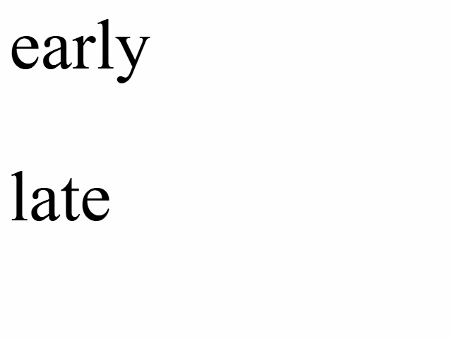

Asserting for non-visibility in the browser can lead to false positives.

Consider how elements load [asynchronously](https://en.wikipedia.org/wiki/Ajax_(programming)) in the modern web. In this repo, [index.html](index.html) features an element with text "early", that is loaded immediately, and an element with text "late" that takes 1/4 of a second to load.



To the eye, it seems to load almost instantly, but our test (we're using Playwright in this example), which expects that is NOT visibile, passes. 

```
await expect(page.getByText('late')).not.toBeVisible();
```

Why? Because tools like Playwright are very fast! The page loads and Playwright immediately asserts that the element is not visible and the test passes. Unfortunately, the element renders 250 milliseconds later (as content often does on the web) and we get a false positive scenario.

Checking that an element is initially visible and THEN becomes non-visible can be a reliable and meaningful test. However, testing that an element was NEVER visible can be tricky and lead to false positives.

Run `npm i && npx playwright test` to see it in action.
